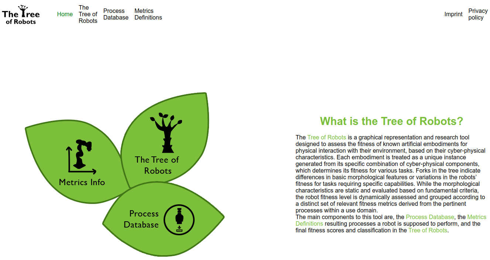

# Tree Of Robots User Guide
_Step by step guide on how to include your robot in the Tree Of Robots_

Official Implementation for the "The Tree of Robots" journal article (under review 2024).


## Description
This guide describes how to include your robot in the _Tree Of Robots_. 
<!---You can either choose to keep the result private or, with a simple step, to contribute to the public database. 
-->
<!---
## Badges
On some READMEs, you may see small images that convey metadata, such as whether or not all the tests are passing for the project. You can use Shields to add some to your README. Many services also have instructions for adding a badge.>
-->

## requirements
- Python3 (code tested with Python 3.8.10)
- `git`


## Installation
<details closed>
  <summary><h3>Ubuntu 20.04</h3></summary>

Clone the repository using `git` command
```
git clone https://gitlab.lrz.de/AlessandroMelone/treeofrobotsuserguide.git
```
create a python environment
```
cd treeofrobotsuserguide
python -m venv .environment
source .environment/bin/activate
```
and install the required packages
```
pip install -r requirements.txt
```

</details>
<details closed>
  <summary><h3>Windows 10</h3></summary>
  
Clone the repository using `git` command
```
git clone https://gitlab.lrz.de/AlessandroMelone/treeofrobotsuserguide.git
```
create a python environment
```
cd treeofrobotsuserguide
python -m venv environment
environment\Scripts\activate
```
and install the required packages
```
pip install -r requirements.txt
```

</details>


## Usage
Source the python virtual environment:
</details>
<details closed>
  <summary>Windows</summary>

```
environment\Scripts\activate
```
</details>  
</details>
<details closed>
  <summary>Ubuntu</summary>

```
source .environment/bin/activate
```
</details>  


And run the python script:
```
python3 FlaskWebsite/app_test.py
```
Now, open you favorite web browser and go at the address shown in the terminal output (e.g., `http://127.0.0.1:5000
`). If everything worked as expected, you should see:



## Support
For any issues click on "New issue" in the _Issues_ section. Alternatively, you can contact the repository maintainer at robin-jeanne.kirschner@tum.de. 


## Contributing
State if you are open to contributions and what your requirements are for accepting them.

For people who want to make changes to your project, it's helpful to have some documentation on how to get started. Perhaps there is a script that they should run or some environment variables that they need to set. Make these steps explicit. These instructions could also be useful to your future self.

You can also document commands to lint the code or run tests. These steps help to ensure high code quality and reduce the likelihood that the changes inadvertently break something. Having instructions for running tests is especially helpful if it requires external setup, such as starting a Selenium server for testing in a browser.

## Authors and acknowledgment
Authors:
- Robin Jeanne Kirschner
- Alessandro Melone
- Kübra Karacan
- Samuel Schneider


